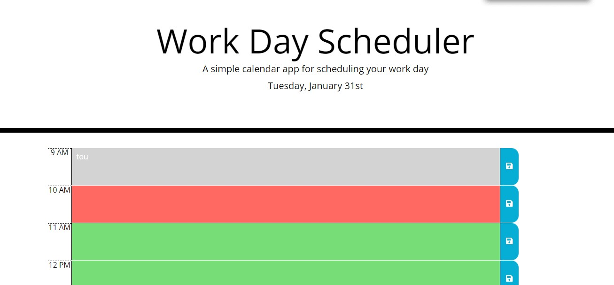

# work-day-schedular

## Description

A web application for scheduling the day's events. It uses Jquery to render timeblocks for the day and dynamically displays past, present and future dates using moment.js. It also displays the current date above the timeblocks.  
User data is persisted and so it is a recommended tool for planning your day even more helpful if you are a programmer. Find the deployed link [here](https://brian-machiestay.github.io/work-day-schedular/).  
  
## Features
- Dynamically highest timeblocks based on current time
- Persist user data
- use moment.js api

## Deployment
Below is a preview of the deployed application.

